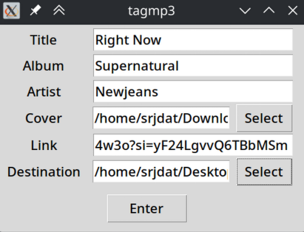
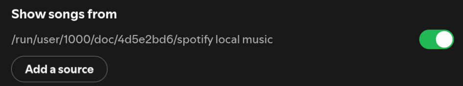

#### Currently this is geared towards MacOS and Linux, I may or may not work on Windows, but it is easy to manually update these tags on Windows. 

# Spotify Local File Tagger

## What it does

Getting customized local files to show up correctly on Spotify (with the right artist, album, and cover art) is pretty tedious and annoying on every system. This project simplifies that by downloading a track from YouTube and automatically tagging it with the metadata Spotify needs, so it shows up properly in your local files.

## Requirements
- Python3

## Before running the program
Make sure you have a folder somewhere you are storing your local files for Spotify.

## How to get started 
1. Clone this repository
2. Go to the directory of this project and do `pip install -r requirements.txt`
3. Run either `python tagmp3cli.py` or `python tagmp3gui.py` depending on whether you want GUI or CLI. 
   - This will make this script executable globally (on MacOS and Linux).
   - You can exit the program by entering `CTRL + C` on the terminal or closing the GUI window after running it for the first time. 
4. Run `tagmp3` from anywhere on your computer

## Running the program
### CLI
After running `tagmp3` it will ask for the destination folder and then the tags.    
Whenever there is a ">" symbol, it is for the user to type.     
Enter all inputs in quotes.
```
usr % tagmp3
Destination folder
> "enter/path/to/folder/in/quotes"
Title Artist Album Album_Artist Front_Cover Youtube_Link
> "Right Now" "NewJeans" "Supernatural" "NewJeans" "path/to/front/cover.png" "https://youtu.be/m6pTbEz4w3o?si=zhu30LJmH0YauPbw"
```


### GUI
After running `tagmp3` a GUI will pop up asking for Title, Artist, Album, Cover, Youtube Link, and Destination folder.   
Cover and Destination will give you the abilitiy to choose your own through a dialog box (click select button to access the dialog box). 

   
Enter all the fields freely with no need to worry about quotes

## After running
Go to Spotify settings and turn off and on the folder that you are using for local files. 


Turn this off and on

Your newly tagged track should appear with the correct metadata!

## Additional Information
- Spotify sometimes doesn't show the cover art reliably on Linux
   - This issue isn't a fault of the program, Linux doesn't have the best support for everything
- Sometimes it will require you to turn on and off the source folder or local files in general a couple of times before this works (this is just how Spotify is). 
